# SwampCTF - March 2018

[https://play.swampctf.com/](https://play.swampctf.com/)

## REV - Dragon's Horde

## REV - Journey

## REV - Window of Opportunity


This reversing problem required the player to decompile the binary
and figure out how to gain access to a flag. Connecting to the server
shows that the binary doesn't take any user input, generates a key
and then says "NOT AUTHORIZED" as shown in the example below.

```
$ nc chal1.swampctf.com 1313
> LOGON
PROCESSING LOGON REQUEST .....

> GET TIME
THE TIME IS NOW 1522638772

> GENERATE TOKEN "1522638772"
GENERATING TOKEN .....
YOUR ACCESS TOKEN: 0xffeffcf6

> RUN "V:\OS\GETFLG.BIN" WITH KEY "0xffeffcf6"
NOT AUTHORIZED
TERMINATING CONNECTION...
```

On to decompilation! Looking at `main` there is a rather suspect
loop which XORs a 32-bit value byte-by-byte across a large chunk
of random-looking data in the binary (both the loop and random
chunk are shown below in IDA). Guessing that the characers "flag"
were somwhere in this chunk, I tried creating a key that would
decrypt "flag" at each offset in the data chunk. I wrote this up
in a short (and ugly) python script and found key that worked.
The script and output are below.

```python
import subprocess
import struct

def xxd(data):
    print subprocess.Popen(['xxd','-'],stdin=subprocess.PIPE,stdout=subprocess.PIPE).communicate(data)[0]

with open('OS.BIN','rb') as f:
    f.seek(0x00000de0)
    data = f.read(0xb8)
    f.close()

xxd(data)

for i in range(len(data)-4):
    key = struct.unpack('I','flag')[0] ^ struct.unpack('I',data[i:i+4])[0]
    key = struct.pack('I',key)
    print binascii.hexlify(key)
    key = key[((4-i)%4):] + key[:((4-i)%4)]
    xxd(''.join(chr(ord(data[j])^ord(key[j%4])) for j in range(len(data))))
```

```
a923b000
00000000: b772 ca69 ffff ffb7 72ea 55ff ffff b7d6  .r.i....r.U.....
00000010: 0db7 762e 09e9 b700 39b7 0036 8a09 b772  ..v.....9..6...r
00000020: ca8c ffff ff7c c900 b7ce 3f01 3fb7 ce00  .....|....?.?...
00000030: b700 38b7 72ca 9cff ffff f0fa b7ce 3f4f  ..8.r.........?O
00000040: fdb7 72c2 afff ffff b7ce 09b7 ce2d f0fa  ..r..........-..
00000050: b776 3eb7 7e13 fffd ffff b7ce 3fb7 7630  .v>.~.......?.v0
00000060: b776 1945 00fe ffff f0fa b77c 07ff 81e2  .v.E.......|....
00000070: b776 3eb7 ce3f 013f b7ce 00b7 0038 b776  .v>..?.?.....8.v
00000080: 19b7 7635 f0fa b77e 3bff fdff ffb7 ce00  ..v5...~;.......
00000090: b7ce 3f4f c3f0 faff 666c 6167 ff41 4343  ..?O....flag.ACC
000000a0: 4553 5320 4752 414e 5445 440a 5255 4e4e  ESS GRANTED.RUNN
000000b0: 494e 4720 2e2e 2e0a                      ING ....
```

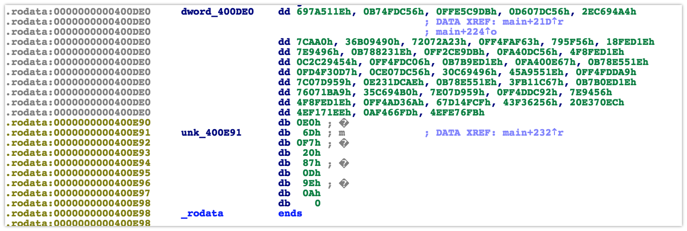
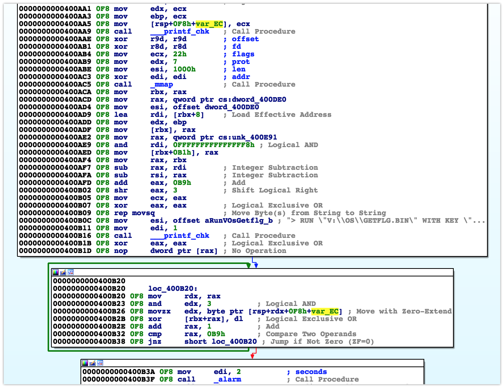

After some more fiddling around, I figured out that the 32-bit "key"
I recovered was inverted and byte reversed - giving the _real_ key
of `0xff4fdc56`. Looking further up in `main` we find that the program
generates this key from the current time (IDA decompilation below).
It looks like the program only uses the lowest 16-bits of the current
time in seconds and also ignores the bottom two bits (so has a
granularity of 4 seconds). Using the decompilation, I wrote another
short script to compute current times (in seconds, modulo 2^16) which
create my target key. This script then slept until it hit one of those
times and exited.

```python
valid_times = {}
for t in range(0,0x10000,4):
    #print(t)
    eax = (t&0xf0)<< 8
    ecx = ((t&0xff00)<<16) | ((t&0xffc)<<8) | (t&0xfc)
    ebp = (((t&0xffc)<<16) - 0x14C437BE) % 2**32
    ans = ecx | (eax ^ ebp)
    print(t, hex(ans))
    if ans == 0xff4fdc56:
        valid_times[t] = None

print(sorted(valid_times.keys()))
while int(time.time()+4) % 0x10000 not in valid_times:
    t = int(time.time())
    t0 = t%0x10000
    countdown = min([(x-t0)%0x10000 for x in valid_times])
    print(t, t0, 0x10000, countdown, countdown/60.)
    time.sleep(.5)
```

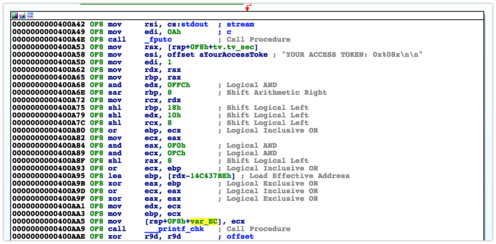

With this script in hand, I quite simply ran it, and when it
exited immediately connected to the server for a flag.

```
$ ./windowofopportunity.py ; nc chal1.swampctf.com 1313
...
```


## REV - Pilgrim

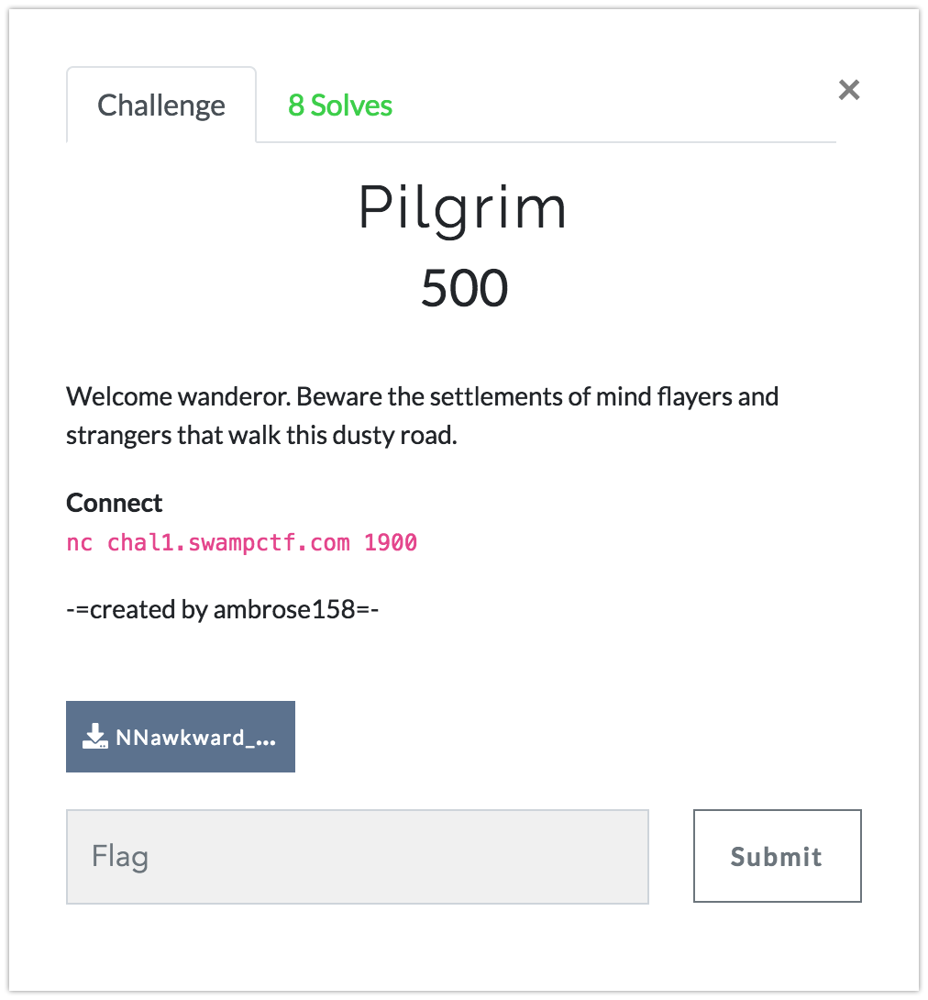

This was another reversing problem. Doing some quick reverse engineering
the binary showed several double constants (shown below) in the binary which were used
to fill in what look like some arrays. Testing the binary on the server
showed that these contants are used in the "bias" array and produce different
output (as shown below).

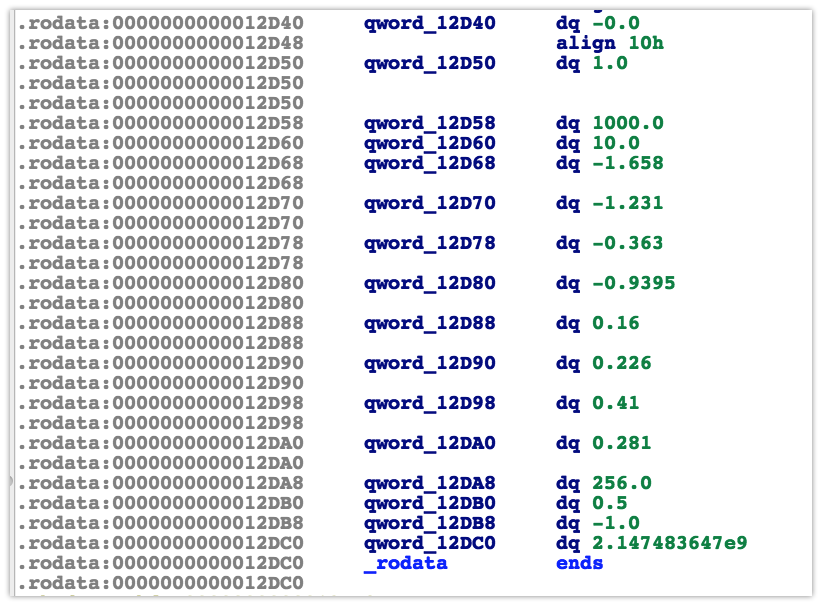
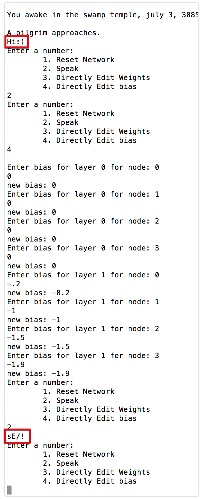

With a little trial and error, I found that each bias value contributed
to one letter of the "speak" text. Getting these to spell out flag revealed
the answer below.

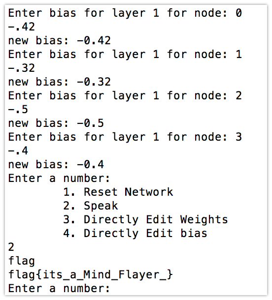

## REV - Chicken Chaser

## MISC - Secret Plans

## MISC - ICastBash

## MISC - Orb of Light 2: Save Cormyr

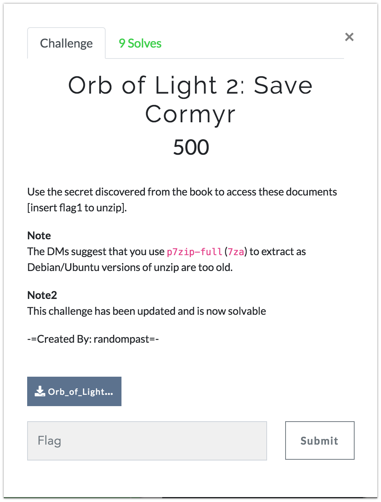

This challenge was slightly confusing, but after re-reading the hint several
times, it became obvious that tuple values in the provided file were to be used
for a trajectory computation. Using google and finding the forumla for a trajectory
showed that the endpoint for each tuple trajectory was in a confined spot. Plotting
these values revealed the flag. A script to compute (x,y) values from each tuple
and the plotted (x,y) values are shown below.

```python
import pickle
import matplotlib.pyplot as plt

pages = pickle.load(open('./Orb_of_Light_p2_SaveCormyr/page_of_numbers.p'))
examples = pickle.load(open('./Orb_of_Light_p2_SaveCormyr/examples.p'))

def trajectory(coords):
    (x,y,v,a,o) = coords
    g = 9.80665
    td = 2*v*math.sin(a)
    d  = v**2 / g * math.sin(2 * a)
    sx = round(y-math.sin(o)*d)
    sy = round(x-math.cos(o)*d)
    return sx, sy

for val,ans in examples:
    assert ans == trajectory(val)

xarr = []
yarr = []
for val in pages:
    x,y = trajectory(val)
    #print(x,y)
    xarr.append(-x)
    yarr.append(y)

plt.scatter(yarr,xarr,c='b')
plt.show()
```


## MISC - Orb of Light 3: Disjunction

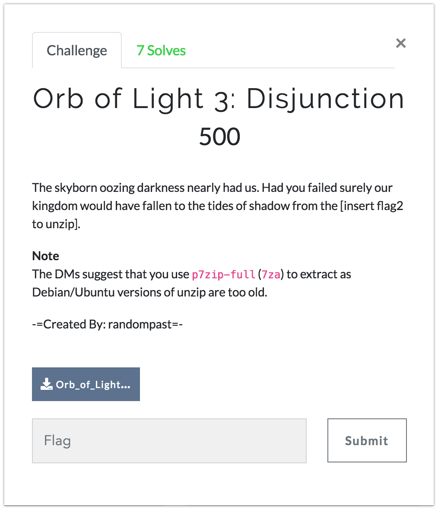

This challenge started out with 6400 10x10 pixel images. Each was in a numbered
folder and had a filename of the form fragment-0nnnn.png. Sorting these by the
filename and combining them into one image showed a picture with the flag in it.
The most time consuming part of this problem was taking all the individual 
images and combining them into one. There might have been a better way to do this,
but I decided to use the python png library. The script and resulting combined
image are shown below. The flag is in the image, and you might need to adjust
your brightness or resolution to see it.

```python
import png
import os

files = []
shad = './.shadow_fragments/'
dirs = os.listdir(shad)
for d in dirs:
    p = os.path.join(shad,d)
    for f in os.listdir(p):
        #print(os.path.join(p,f))
        files.append((f,os.path.join(p,f)))
files.sort()
files = [p for (f,p) in files]

ncols = 80
nrows = 80

full_hash = {}

for c in range(ncols):
    for r in range(nrows):
        p = png.Reader(files[80*r+c])
        if r == 0 and c == 0: print(p.read()[3])
        m = p.read()[2]
        palette = p.read()[3]['palette']
        for r0,row in enumerate(m):
            if r == 0 and c == 0:
                print(row)
            for c0,v in enumerate(row):
                full_hash[10*c+c0,10*r+r0] = palette[v]

all_rows = []
for r in range(10*nrows):
    row = []
    for c in range(10*ncols):
        row = row + list(full_hash[c,r])
    #row = [full_hash[c,r] for c in range(10*ncols)]
    all_rows.append(row)

f = open('orb3.png','wb')
w = png.Writer(10*ncols,10*nrows)
w.write(f,all_rows)
f.flush()
f.close()
```


## CRYPTO - Orb of Light 1: Secret

## CRYPTO - Locked Dungeon

## CRYPTO - Locked Dungeon 2

## CRYPTO - Pagoda 1

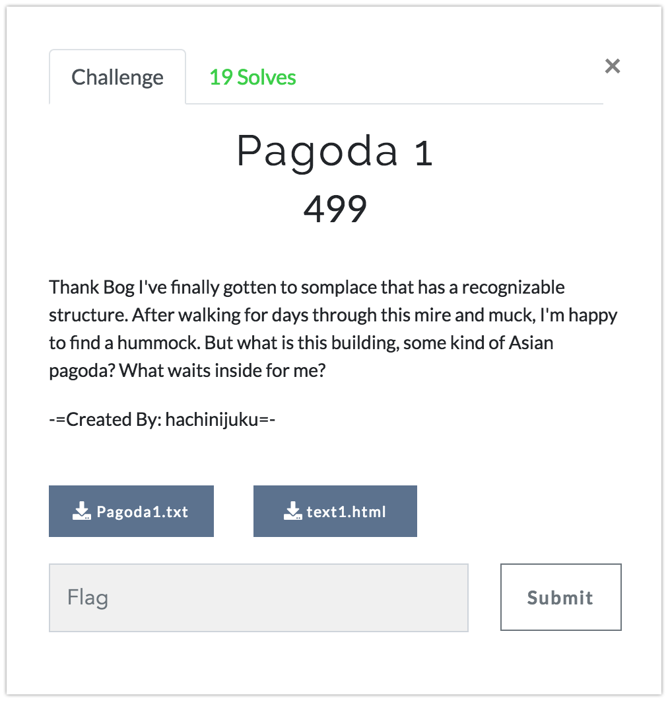

[Hexagram output](files/files/pagoda/text1.htm)

This problem centered involved decoding a bunch of dash and space characters
(shown in the link above). Someone in our group suggested that this could
be a Hexagram cipher. After searching around for cipher, we found a mapping
from hexagrams to integer values [here](https://en.wikipedia.org/wiki/List_of_hexagrams_of_the_I_Ching).
Converting each glyph to six bits and then combining those into bytes (similar
to base64) revealed the answer.

```python
arrs = []
arrs_h = []
h = {' ':0,'-':1}
for line in open('text1.txt'):
    print(line[6::12])
    arrs.append([h[ch] for ch in line[6::12]])
    arrs_h.append([ch for ch in line[6::12]])

cnt = []
cnt_h = []
for j in range(len(arrs[0])):
    cnt.append(sum([(arrs[i][j]<<(5-i)) for i in range(6)]))
    cnt_h.append(''.join(arrs_h[i][j] for i in range(6)))

hexagram_lookup = '''------
      
 -   -
-   - 
 - ---
--- - 
    - 
 -    
-- ---
--- --
   ---
---   
---- -
- ----
   -  
  -   
 --  -
-  -- 
    --
--    
- -  -
-  - -
-     
     -
---  -
-  ---
-    -
 ---- 
 -  - 
- -- -
 ---  
  --- 
----  
  ----
- -   
   - -
-- - -
- - --
 - -  
  - - 
-   --
--   -
 -----
----- 
 --   
   -- 
 -- - 
 - -- 
 --- -
- --- 
  -  -
-  -  
-- -  
  - --
  -- -
- --  
-- -- 
 -- --
--  - 
 -  --
--  --
  --  
 - - -
- - - '''

hexagram = {}
for i,h in enumerate(hexagram_lookup.split('\n')):
    hexagram[h] = i

b64alph = 'ABCDEFGHIJKLMNOPQRSTUVWXYZabcdefghijklmnopqrstuvwxyz0123456789+/'
ints = [hexagram[h] for h in cnt_h] # text1
print base64.b64decode(''.join(b64alph[c] for c in ints))
```

## CRYPTO - Pagoda 2

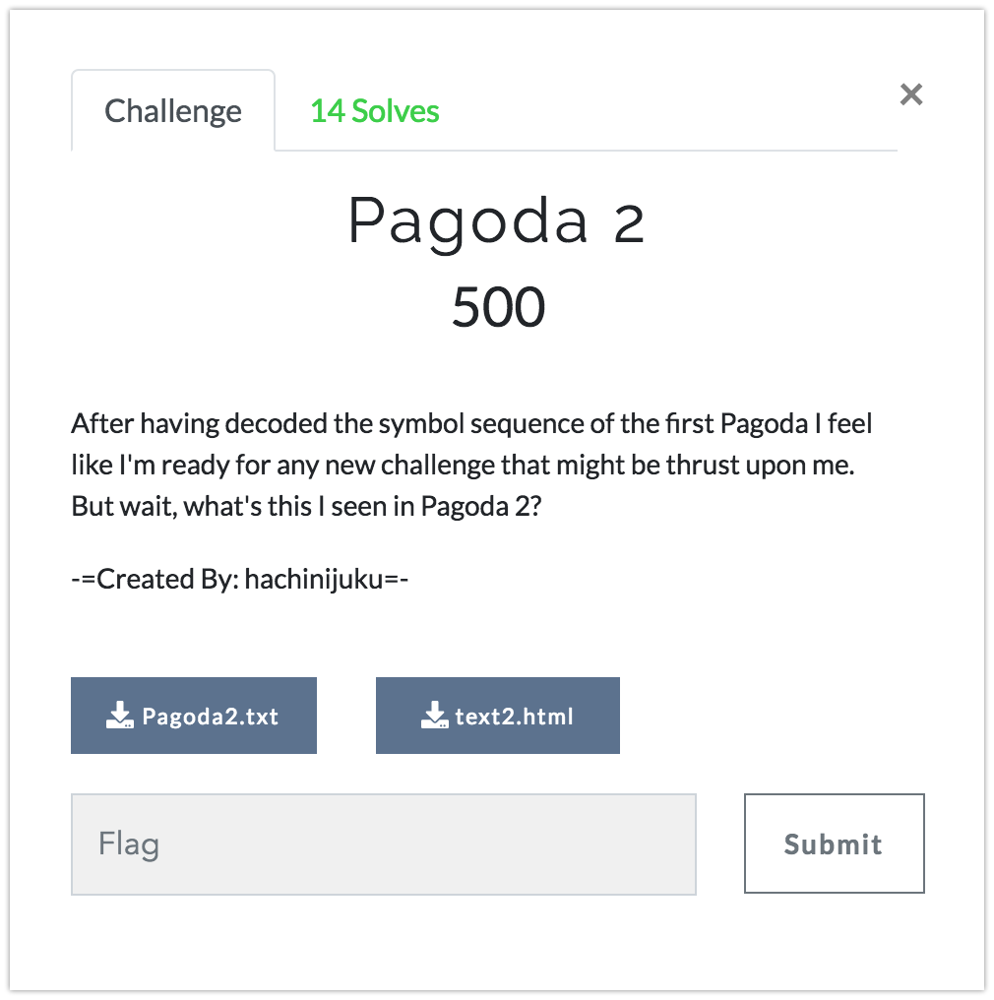

This problem was nearly identical to Pagoda 1. The clue for this one
suggested "reflection" in several spaces, so you guessed it - just
invert each pattern top-to-bottom. The same script as above was used
with the last `ints` line replaced:

```python
ints = [hexagram[''.join(reversed([x for x in h]))] for h in cnt_h] # text2
```

## CRYPTO - Pagoda 3

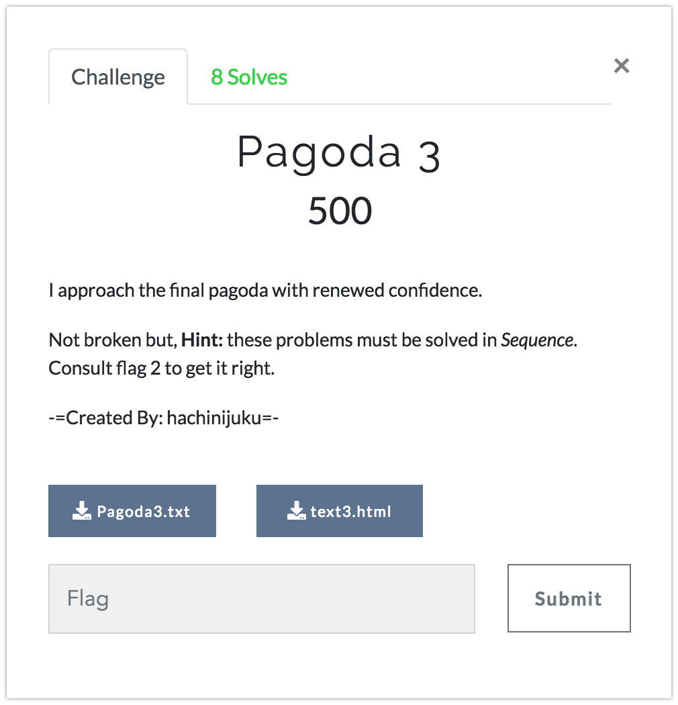

Finally, the last pagoda hint suggested that "trigrams" were used. After
googling around for a while, a trigram mapping was found. Each glyph in
this problem represented two 3-bit values, which could be combined as before.
The solutions to all three pagoda problems are shown below.

```python
import base64

arrs = []
arrs_h = []
h = {' ':0,'-':1}
for line in open('text3.txt'):
    print(line[6::12])
    arrs.append([h[ch] for ch in line[6::12]])
    arrs_h.append([ch for ch in line[6::12]])

cnt = []
cnt_h = []
for j in range(len(arrs[0])):
    cnt.append(sum([(arrs[i][j]<<(5-i)) for i in range(6)]))
    cnt_h.append(''.join(arrs_h[i][j] for i in range(6)))

trigram_lookup = '''---
 --
- -
  -
-- 
 - 
-  
   '''

trigram = {}
for i,h in enumerate(trigram_lookup.split('\n')):
    trigram[h] = i

b64alph = 'ABCDEFGHIJKLMNOPQRSTUVWXYZabcdefghijklmnopqrstuvwxyz0123456789+/'
ints = [((trigram[h[0:3]]<<0)+(trigram[h[3:6]]<<3))^0x3f for h in cnt_h] # text3
print base64.b64decode(''.join(b64alph[c] for c in ints))
```

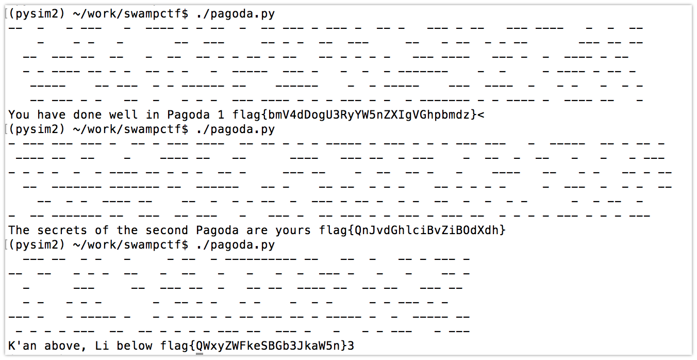

## FORENSIC - Wild Night Out

## FORENSIC - Orcish

## PWN - Apprentice's Return

